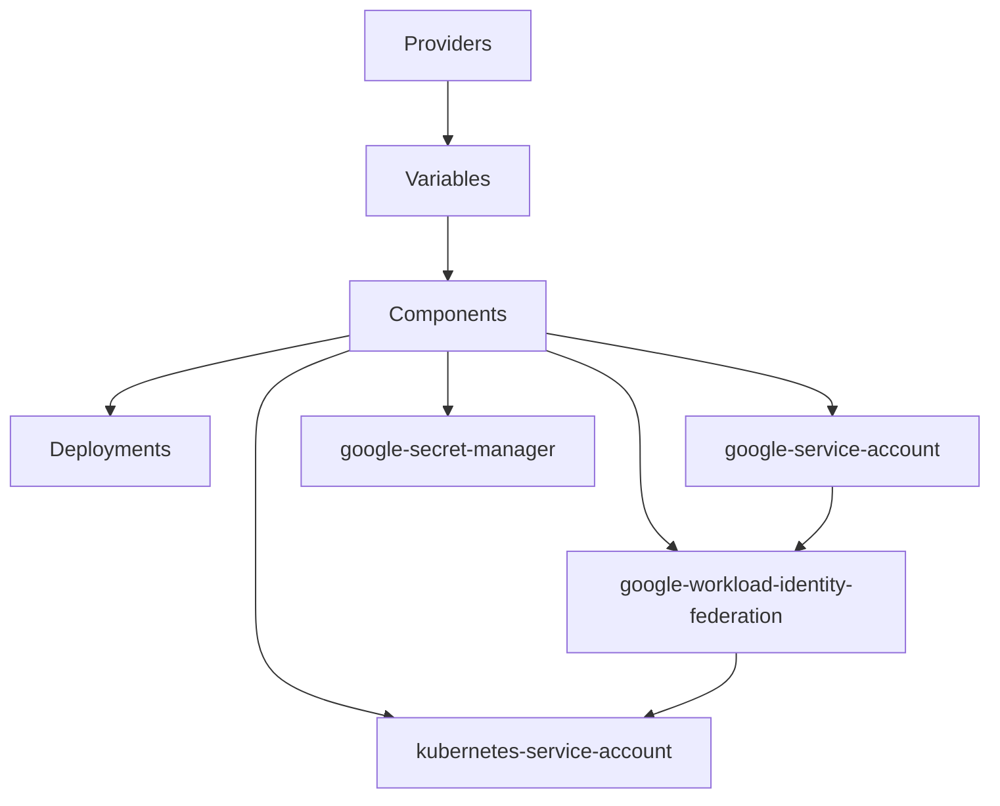
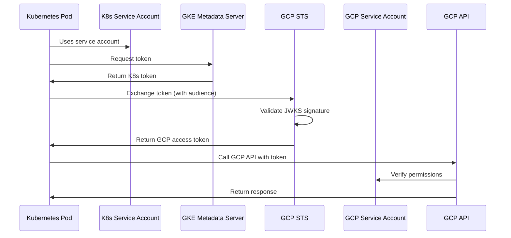
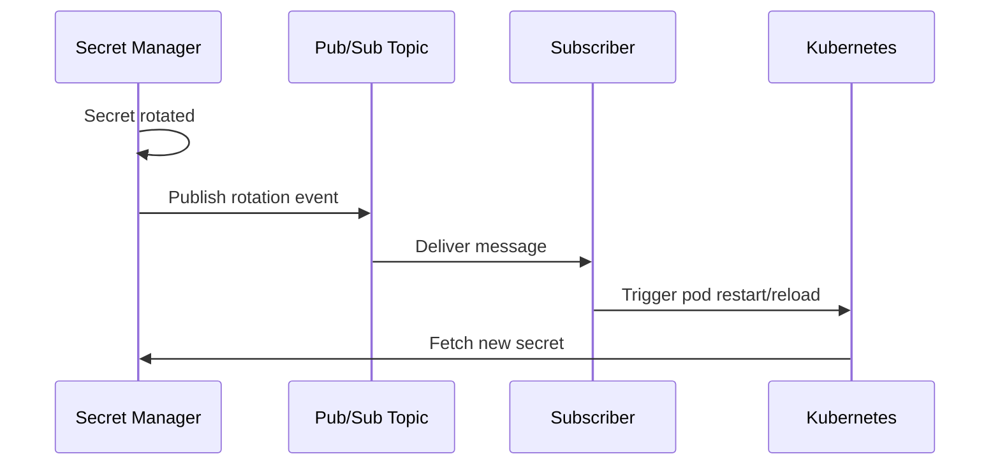
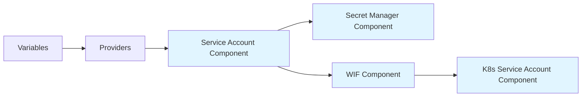

# Architecture Overview

This document provides a comprehensive overview of the GCP infrastructure architecture managed by Terraform Stacks.

## Table of Contents

- [Stack Structure](#stack-structure)
- [Component Architecture](#component-architecture)
- [Data Flow](#data-flow)
- [Security Model](#security-model)
- [Best Practices](#best-practices)

## Stack Structure

The infrastructure is organized using Terraform Stacks with a clear separation of concerns:

```
infra-gcp/
├── components.tfcomponent.hcl      # Component declarations
├── deployments.tfdeploy.hcl        # Deployment configurations
├── providers.tfcomponent.hcl       # Provider configurations
├── variables.tfcomponent.hcl       # Global variables
└── modules/                        # Terraform modules
    ├── google-service-account/
    ├── google-secret-manager/
    ├── google-workload-identity-federation/
    └── kubernetes-service-account/
```

### Hierarchical Structure



## Component Architecture

### 1. Google Service Account Component

**Purpose**: Manages GCP service accounts and IAM role assignments.

**Resources Created**:
- GCP service accounts
- IAM policy bindings for project-level roles

**Key Features**:
- Dynamic service account creation based on configuration
- Automated role assignment
- Support for multiple service accounts with different permissions

**Configuration**:
```hcl
gcp_service_service_accounts = {
  "k8s-admin" = {
    display_name = "k8s Admin Service Account"
    roles = ["roles/container.admin", "roles/iam.serviceAccountUser"]
  }
}
```

### 2. Google Secret Manager Component

**Purpose**: Manages Secret Manager integration and rotation notifications.

**Resources Created**:
- Pub/Sub topics for certificate rotation notifications
- IAM bindings for Secret Manager service agent
- API enablement for Secret Manager and Service Usage

**Key Features**:
- Automated Pub/Sub topic creation per cluster
- Secret Manager service agent provisioning
- Pub/Sub publisher permissions for rotation events

**Configuration**:
```hcl
k8s_ca_certificate_refs = {
  "k8s-production" = {
    enable_pub_sub = true
    labels = { environment = "production" }
  }
}
```

### 3. Google Workload Identity Federation Component

**Purpose**: Enables Kubernetes workloads to authenticate to GCP without static credentials.

**Resources Created**:
- Workload Identity Pool (if using GKE)
- IAM bindings for workload identity user role
- OIDC identity provider configuration

**Key Features**:
- Zero Trust authentication model
- Support for multiple Kubernetes clusters
- JWKS-based token validation
- Service account impersonation

**Configuration**:
```hcl
k8s_clusters = {
  "k8s-production" = {
    issuer_uri = "https://kubernetes.default.svc.cluster.local"
    allowed_audiences = ["sts.googleapis.com"]
    jwks_json_data = "<jwks-data>"
    kubernetes_service_accounts = { ... }
  }
}
```

### 4. Kubernetes Service Account Component

**Purpose**: Creates and configures Kubernetes service accounts with Workload Identity annotations.

**Resources Created**:
- Kubernetes service accounts
- Service account annotations for GCP binding
- Labels for organization

**Key Features**:
- Automatic annotation with GCP service account email
- Namespace-aware service account creation
- Support for custom labels and annotations

## Data Flow

### Workload Identity Authentication Flow



### Secret Rotation Notification Flow



### Component Dependency Flow



## Security Model

### Zero Trust Principles

The infrastructure implements Zero Trust security through:

1. **No Static Credentials**: Workload Identity eliminates long-lived service account keys
2. **Identity-Based Access**: Each workload has its own identity mapped to specific GCP permissions
3. **Least Privilege**: Service accounts have minimal required permissions
4. **Token-Based Authentication**: Short-lived tokens with automatic rotation

### IAM Hierarchy

```
GCP Project
├── Service Accounts
│   ├── k8s-admin (container.admin, iam.serviceAccountUser)
│   ├── k8s-secret-reader (secretmanager.secretAccessor)
│   ├── k8s-storage-admin (storage.objectAdmin)
│   └── k8s-monitoring (monitoring.metricWriter, logging.logWriter)
│
└── Workload Identity Bindings
    ├── k8s-production[kube-system/cluster-admin] → k8s-admin
    └── k8s-production[default/default-app] → k8s-secret-reader
```

### Authentication Flow

1. **Terraform Cloud Authentication**:
   - OIDC token from Terraform Cloud
   - Workload Identity Federation to GCP
   - Service account impersonation

2. **Kubernetes Workload Authentication**:
   - Pod uses Kubernetes service account
   - GKE metadata server provides token
   - Token exchange via STS
   - Access GCP APIs with temporary credentials

## Best Practices

### Service Account Management

1. **Principle of Least Privilege**: Grant minimum required permissions
2. **Separate Service Accounts**: Use different service accounts for different purposes
3. **Descriptive Names**: Use clear naming conventions (e.g., `k8s-<purpose>`)
4. **Regular Audits**: Review service account usage and permissions

### Workload Identity Configuration

1. **Unique Service Accounts**: Each workload type should have its own Kubernetes service account
2. **Namespace Isolation**: Use namespaces to isolate workloads
3. **Audience Validation**: Configure allowed audiences to prevent token misuse
4. **JWKS Rotation**: Regularly rotate JWKS for enhanced security

### Secret Management

1. **External Secrets**: Store sensitive data in Secret Manager, not in code
2. **Rotation Notifications**: Use Pub/Sub topics to handle secret rotation events
3. **Access Logging**: Enable audit logs for secret access
4. **Replication Strategy**: Choose appropriate replication (automatic vs user-managed)

### Infrastructure as Code

1. **Version Control**: All infrastructure changes through Git
2. **Peer Review**: Require code review for infrastructure changes
3. **Environment Separation**: Use separate deployments for different environments
4. **Documentation**: Keep documentation in sync with code changes

### Deployment Strategy

1. **Plan First**: Always run `terraform plan` before applying
2. **Incremental Changes**: Make small, focused changes
3. **Rollback Plan**: Know how to revert changes if needed
4. **Testing**: Test in non-production environments first

## Scalability Considerations

### Multi-Cluster Support

The architecture supports multiple Kubernetes clusters through:
- Cluster-specific configurations in `k8s_clusters` variable
- Independent Workload Identity Federation setup per cluster
- Separate Pub/Sub topics for each cluster

### Adding New Clusters

To add a new cluster:

1. Add cluster configuration to `k8s_clusters` variable
2. Define Kubernetes service accounts for the cluster
3. Specify GCP service account mappings
4. Apply Terraform configuration
5. Configure cluster with Workload Identity

### Performance Optimization

1. **Token Caching**: GKE metadata server caches tokens
2. **Parallel Resource Creation**: Terraform creates independent resources in parallel
3. **API Quotas**: Monitor GCP API quotas for high-volume operations
4. **Regional Resources**: Use regional resources to reduce latency

## Monitoring and Observability

### Key Metrics to Monitor

1. **Service Account Usage**: Track which service accounts are actively used
2. **Token Exchange Failures**: Monitor STS token exchange errors
3. **Secret Access**: Audit logs for Secret Manager access
4. **Pub/Sub Delivery**: Monitor message delivery for rotation notifications

### Logging

Enable audit logs for:
- IAM policy changes
- Service account key creation (should be zero with WIF)
- Secret Manager access
- Workload Identity token exchanges

## Disaster Recovery

### Backup Considerations

1. **Terraform State**: Ensure Terraform state is backed up (Terraform Cloud handles this)
2. **Service Account Keys**: No keys to back up (using Workload Identity)
3. **Secrets**: Secret Manager handles versioning and replication
4. **Configuration Files**: Version controlled in Git

### Recovery Procedures

1. **Service Account Deletion**: Re-run Terraform to recreate
2. **IAM Binding Loss**: Terraform will detect and restore bindings
3. **Workload Identity Misconfiguration**: Verify JWKS and issuer URI
4. **Complete Infrastructure Loss**: Restore from Git and Terraform state

## Future Enhancements

Potential improvements to the infrastructure:

1. **Multi-Project Support**: Extend to manage resources across multiple GCP projects
2. **Automated Secret Rotation**: Implement automated secret rotation workflows
3. **Policy as Code**: Add organization policies and constraints
4. **Cost Optimization**: Implement resource tagging and cost allocation
5. **Enhanced Monitoring**: Add custom dashboards and alerting
